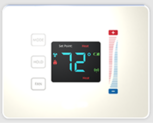
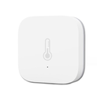
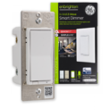
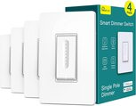
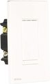
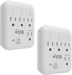
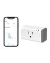
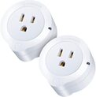
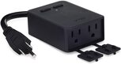

# Home Assistant configuration

This is my primary [Home Assistant](https://home-assistant.io/) core configuration.  The Home Assistant instance is running on a home server running [Unraid](https://unraid.net/) via the official [docker](https://hub.docker.com/r/homeassistant/home-assistant) image.

Home Assistant is configured to control all devices locally and is 100% cloud free. 

## Hardware

Unraid server runs on a custom PC with the following components.  I use this server as a NAS and run a whole bunch of additional services.  One does not need such hardware to run Home Assistant and can get away with a basic [Raspberry Pi](https://www.raspberrypi.com/products/raspberry-pi-4-model-b/).

- [AMD Ryzen 3600](https://www.amd.com/en/products/cpu/amd-ryzen-5-3600)
- [Gigabyte B450 AORUS PRO WIFI](https://www.gigabyte.com/Motherboard/B450-AORUS-PRO-WIFI-rev-1x#kf) (WIFI Card repalced with Coral Edge TPU)
- [32GB (2 x 16GB) OLOy DDR4 3200 RAM](https://www.newegg.com/oloy-32gb-288-pin-ddr4-sdram/p/N82E16820821332)
- [GoControl HUSBZB-1 Z-Wave & Zigbee USB Stick](https://www.amazon.com/GoControl-CECOMINOD016164-HUSBZB-1-USB-Hub/dp/B01GJ826F8/)
- [Wyze Cam V2](https://wyze.com/wyze-cam-v2.html) running [Dafang Hacks](https://github.com/EliasKotlyar/Xiaomi-Dafang-Hacks) providing RTSP streams (Used Dafang firmware as the RTSP firmware from Wyze is buggy)
- Old [Nvidia GTX 750 Ti](https://www.evga.com/products/specs/gpu.aspx?pn=70b14ba6-5853-4a65-aacf-cff61f466d82) (For hardware accelerated RTSP stream decoding)
- [M.2 Coral Edge TPU](https://coral.ai/products/m2-accelerator-dual-edgetpu/) (For person detection using [Frigate](https://frigate.video/))
- 4 x 4TB Hitachi 7200 RPM drives (Provides NAS storage)
- [512GB HP EX920 NVMe](https://www.amazon.com/HP-EX920-Internal-2YY46AA-ABC/dp/B0795X5HJL) (Cache drive for NAS storage)

## Software

- [Unraid](https://unraid.net/) for NAS and Virtualization Server
- [Home Assistant](https://home-assistant.io/) via [docker](https://hub.docker.com/r/homeassistant/home-assistant) image.
- [Z-WaveJS](https://github.com/zwave-js) via [docker](https://hub.docker.com/r/zwavejs/zwavejs2mqtt) image
- Reverse Proxy using [Let's Encrypt](https://letsencrypt.org/) and [NGINX](https://www.nginx.com/) via [docker](https://hub.docker.com/r/linuxserver/letsencrypt) image
- [DuckDNS](https://www.duckdns.org/) for dynamic DNS; Home IP kept up-to-date via the [docker](https://hub.docker.com/r/linuxserver/duckdns/) application
- [Frigate](https://frigate.video/) NVR & Person Detection
- [Node-Red](https://nodered.org/) for automations

# Smart Home Devices

## Lighting

Most of the lighting is controlled via smart switches.  However, these switches require a neutral wire.  In places where neutral wire is not available, I use smart bulbs.  The drawback of using smart bulbs is that if the physical switch is turned off, then there is no way to turn control using Home Assistant.  

| Device | Protocol | Purpose |
| ------ | -------- | ------- |
| [TRÅDFRI LED Driver](https://www.ikea.com/us/en/p/tradfri-driver-for-wireless-control-gray-60342661/)|Zigbee|For powering kitchen [under cabinet](https://www.ikea.com/us/en/p/mittled-led-kitchen-cntrtp-lighting-strip-dimmable-white-00455420/) and [in cabinet](https://www.ikea.com/us/en/p/vaxmyra-led-spotlight-aluminum-color-90421888/) lights.  Since the lights were retrofitted, I had to use three different TRADFRI LED drivers to power all the lights without intrusive wiring.  This meant I had to use a zigbee remote switch to turn them all on/off at the same time.  I used the ones that came with the [EcoSmart Bulb](https://www.homedepot.com/p/EcoSmart-60-Watt-Equivalent-A19-CEC-SMART-LED-Light-Bulb-Tunable-White-Starter-Kit-1-Bulb-A9A19A60WESDZR1/310288335).  [TRADFRI Remote](https://www.ikea.com/us/en/p/tradfri-remote-control-00443130/) can also be used for this purpose.|
| [EcoSmart Bulb](https://www.homedepot.com/p/EcoSmart-60-Watt-Equivalent-A19-CEC-SMART-LED-Light-Bulb-Tunable-White-Starter-Kit-1-Bulb-A9A19A60WESDZR1/310288335)|Zigbee|Wall scone light fixture powered from an outlet|
| [Sylvania OSRAM Lights](https://www.amazon.com/73742-SYLVANIA-Adjustable-SmartThings-Assistant/dp/B015KQ29JI)| Zigbee | Recessed lighting.  These are directly paired with Home Assistant and not via the Lighitify bridge that it originally came with. |
|  | Zigbee | To control all smart bulbs, I use the ZigBee remote that came with [EcoSmart Bulb](https://www.homedepot.com/p/EcoSmart-60-Watt-Equivalent-A19-CEC-SMART-LED-Light-Bulb-Tunable-White-Starter-Kit-1-Bulb-A9A19A60WESDZR1/310288335).  The physical switches are always left on and the ZigBee remote is used as the sole control for the smart bulbs.  Each button press triggers a ZigBee message (zha_event) containing a unique identifier for each remote.  Based on this identifier, a NodeRed automation triggers an action on the proper light bulb group. |

## Climate

| Device | Protocol | Purpose |
| ------ | -------- | ------- |
|    CentraLite Pearl Thermostat| Zigbee | Climate Control
|    Aqara Temp Sensor| Zigbee | Temperature and Humidity sensor used on bedrooms.  Average temperature from these sensors and the thermostat is used to turn on/off the thermostat.  This mimics the EcoBee thermostat feature albeit locally|

## Switches

| Device | Protocol | Purpose |
| ------ | -------- | ------- |
|    GE Zwave Dimmer | Z-Wave | These switches are used to control regular non-smart recessed lights.|
|    TreatLife Dimmer | Wifi | Cheap dimmer switches that gets the job done.  These are flashed with [tasmota](https://tasmota.github.io/docs/) to achieve local control. [Flashing](https://www.youtube.com/watch?v=ZHA4p3yS4gE) process is sort of involved and requires basic soldering. |
|    Monoprice On/Off Switch | Z-Wave | These are non dimming On/Off switches used in places where dimming functionality is not needed (like bathrooms) |

## Smart Plugs

| Device | Protocol | Purpose |
| ------ | -------- | ------- |
|    KMC Outlet| Wifi | |
|    Sonoff S31| Wifi | |
|    VeSync Plug| Wifi | |
|    Wyze Outdoor Plug| Wifi | |

## Locks

## Garage Door

## Cameras

## Automations

# Future Plans